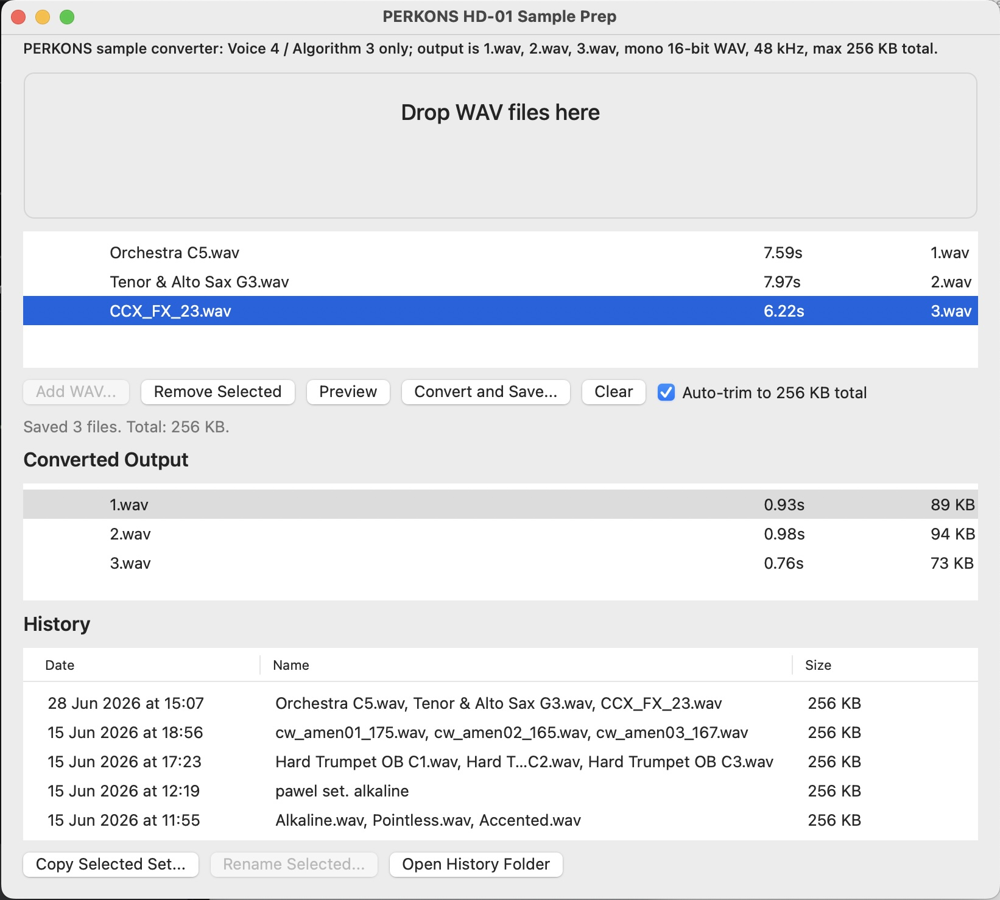

# PERKONS HD-01 Sample Prep

Small macOS app for preparing exactly three user samples for the Erica Synths PERKONS HD-01.

This is a small source-available utility built with AI-assisted coding.



## Status

This is an early, best-effort macOS utility that I originally made for my own
PERKONS HD-01 sample-prep workflow. It may be useful to others, but it is not a
polished commercial product.

Feedback, bug reports, and small feature requests are welcome.

## Requirements

- macOS 14 Sonoma or newer.
- A PERKONS HD-01 workflow that expects three user samples named `1.wav`,
  `2.wav`, and `3.wav`.
- The current prebuilt app bundle is for Apple Silicon (`arm64`).

There is currently no Windows version and no web version. If there is enough
interest, other platforms may be considered later.

## Download and First Run

If a prebuilt release is available, download the app from GitHub Releases,
unzip it, and run `PerkonsSamplePrep.app`.

The current app bundle is ad-hoc signed and is not Apple-notarized. macOS may
show a Gatekeeper warning the first time you open it. If you are not comfortable
running non-notarized apps from independent developers, build it from source
instead.

## Build from Source

If you prefer not to run the prebuilt, non-notarized app bundle, review the
source code and build it locally:

```text
swift build -c release
```

The release executable is written to:

```text
.build/release/PerkonsSamplePrep
```

## Workflow

- Drop WAV files into the app or use `Add WAV...`.
- Files can be added one by one until the set has 3 samples.
- Select a file and click `Remove Selected` to replace it with another file.
- Select a file and press Space, or click `Preview`, to start/stop preview playback.
- The currently playing row shows a play triangle.
- While preview is playing, moving selection with arrow keys stops the previous file and starts the newly selected one.
- After conversion, the `Converted Output` list can be previewed the same way.
- Conversion is enabled only when exactly 3 files are loaded.

## Output

The app writes:

- `1.wav`
- `2.wav`
- `3.wav`

Each file is converted to:

- WAV
- mono
- 16-bit PCM
- 48 kHz

The combined output is kept under `256,000` bytes. If `Auto-trim to 256 KB total` is enabled, the app trims the three samples proportionally so the set fits the PERKONS limit.

## History

Every successful conversion is copied to:

```text
~/Library/Application Support/PerkonsSamplePrep/History
```

Each history set contains `1.wav`, `2.wav`, `3.wav`, and a `manifest.json` with source names, output sizes, durations, and timestamp.

## App

From a local checkout, run:

```text
PerkonsSamplePrep.app
```

## Background Image

The app uses this optional bundle resource as the window background:

```text
PerkonsSamplePrep.app/Contents/Resources/perkons-bg.png
```

`perkons-bg.jpg` also works. After adding or replacing the file, rebuild or re-sign the app bundle.

## History Names

History rows have an editable display name. Select a history row and use `Rename Selected...`.

## Known Limitations

- macOS only.
- No Windows build yet.
- No web version yet.
- The current prebuilt app bundle is Apple Silicon (`arm64`) only.
- The app is not Apple-notarized at this stage.
- Testing has mainly covered my own PERKONS sample-prep workflow and a small
  set of WAV files.
- The app focuses only on preparing three PERKONS-ready WAV files. It is not a
  general-purpose sample editor.

## Feedback

Use `PERKONS Sample Prep > Report Bug or Request Feature...` to open a
prefilled GitHub issue for bugs and feature requests.

This project is maintained in private time on a best-effort basis. There is no
guarantee when, or if, a bug will be fixed or a feature request will be
implemented.

## License

Copyright (c) 2026 Pawel Lamik.

The source code is available under the
[PolyForm Noncommercial License 1.0.0](LICENSE).

You may use, modify, and share the software for noncommercial purposes.
Commercial use is not permitted under this license.

Because commercial use is restricted, this is a source-available license rather
than an OSI-approved open-source license.

In plain language: feel free to use it, share it, fork it, and modify it for
personal or other noncommercial purposes. Do not sell it, bundle it into paid
products, or use it commercially without separate permission.
